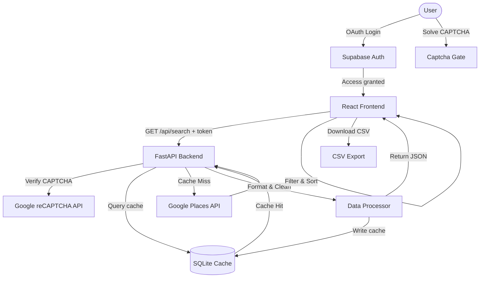

# BizScraper Pro — Local Business Data Extractor

BizScraper Pro is a modern, web-based business data extraction tool that allows users to search for local businesses across any city or region in India by entering a location and a keyword. 

It queries the Google Places API to extract accurate, structured business listings (Name, Address, City, Phone, Website, Rating, and Category), presents them in a sortable, filterable client-ready UI, and exports filtered data directly to CSV. It includes a backend SQLite caching layer to limit redundant API requests.

---

## 🏗️ Architecture & Data Flow

BizScraper Pro uses a decoupled 3-layer architecture: a **React.js Frontend** (secured with Supabase Auth & reCAPTCHA) communicating with a **Python FastAPI Backend** which handles caching in **SQLite** and queries the **Google Places API**.




---

## 🛠️ Technology Stack

### Frontend (React App)
* **Core:** React.js (v18+) & Vite (v5+)
* **Styling:** Tailwind CSS (v3+)
* **State & Fetching:** Axios (HTTP client), React Hot Toast (UI notifications)
* **Authentication:** Supabase Auth (Google OAuth)
* **Security:** react-google-recaptcha
* **Tables:** TanStack Table (v8) — handles sorting, client-side filtering, and pagination

### Backend (FastAPI Server)
* **Web Framework:** Python FastAPI (v0.110+) & Uvicorn (ASGI server)
* **Data Processing:** Pandas (v2+) — cleans JSON results and generates CSV streams
* **Caching & Storage:** SQLite Database + SQLAlchemy (ORM)
* **Rate Limiting:** SlowAPI (limit to 10 requests/minute per IP)
* **Security:** reCAPTCHA server-side verification (via httpx)
* **Scraping Layer:** Google Places (Text Search + Place Details API) & BeautifulSoup4 (HTML parser fallback)

---
## 📂 Project Structure

```text
bizscraper-pro/
├── docx_files/                   # Original specification files in Word format
├── markdown_files/               # Clean converted markdown specifications
│   ├── BizScraper_Pro_PRD.md     # Product Requirements Document
│   ├── BizScraper_Pro_TRD.md     # Technical Requirements Document
│   ├── BizScraper_Pro_Schema.md  # Backend Schema & API specifications
│   ├── BizScraper_Pro_AppFlow.md # Application Flow & User Journey
│   └── BizScraper_Pro_UXDOC.md   # UI/UX & Styling Specification
├── frontend/                     # Frontend source (Vite + React)
│   ├── src/
│   │   ├── components/           # LandingPage, ConsolePage, LoginPage, ProtectedRoute, CaptchaGate, etc.
│   │   ├── context/              # AuthContext for Supabase Google OAuth
│   │   ├── lib/                  # supabaseClient and utility helpers
│   │   ├── services/api.js       # Axios client and route fetchers
│   │   ├── App.jsx               # Main state controller and route definitions
│   │   └── main.jsx              # React Entry point
│   ├── .env                      # Holds configuration variables
│   └── vite.config.js
└── backend/                      # Backend source (Python FastAPI)
    ├── routes/                   # Router definitions (search.py, export.py)
    ├── services/                 # Google API calling & data cleaning logic
    ├── models/                   # Pydantic schemas for requests/responses
    ├── database/                 # SQLite database & caching operations (db.py, cache.py)
    ├── utils/                    # reCAPTCHA verification & rate limiter utilities
    ├── main.py                   # FastAPI entry point, middlewares & CORS configuration
    ├── .env                      # Holds secrets and credentials
    └── requirements.txt          # Python packages (fastapi, requests, pandas, etc.)
```

---

## 🔌 API Endpoints

### 1. Search Endpoint
`GET /api/search?keyword={keyword}&location={location}`
* **Query Params:** `keyword` (required), `location` (required)
* **Response Type:** `application/json`
* **Details:** Checks SQLite cache first. If a matching query is found and is less than 24 hours old, returns it immediately. Otherwise, queries Google Places API (up to 3 pages / 60 results), calls Details API for phone/website, updates SQLite cache, and returns the cleaned array.

### 2. Export Endpoint
`GET /api/export?keyword={keyword}&location={location}&cities={c1,c2}&types={t1,t2}`
* **Query Params:** `keyword` (required), `location` (required), `cities` (optional, comma-separated), `types` (optional, comma-separated)
* **Response Type:** `text/csv` (header: `Content-Disposition: attachment; filename="keyword_location_date.csv"`)
* **Details:** Retrieves matching results from the cache, applies active frontend filters, and streams a clean CSV file using Pandas.

---
## ⚙️ Environment Variables Setup

Create a `.env` file in the respective folders:

### Backend (`/backend/.env`)
```env
GOOGLE_API_KEY=your_google_places_api_key
CACHE_EXPIRY_HOURS=24
MAX_RESULTS=60
ALLOWED_ORIGINS=http://localhost:5173
RECAPTCHA_SECRET_KEY=your_recaptcha_secret_key
```

### Frontend (`/frontend/.env`)
```env
VITE_API_BASE_URL=http://localhost:8000
VITE_SUPABASE_URL=your_supabase_project_url
VITE_SUPABASE_ANON_KEY=your_supabase_anon_key
VITE_RECAPTCHA_SITE_KEY=your_recaptcha_site_key
```

---

## 🚀 Setup & Execution Guide

### Prerequisites
* **Node.js** (v18+) & **Python** (3.11+)
* **Google Cloud Console account** with Google Places API enabled

### 1. Run the Backend
1. Navigate to the backend directory:
   ```bash
   cd backend
   ```
2. Create and activate a python virtual environment:
   ```bash
   python -m venv venv
   # On Windows:
   .\venv\Scripts\activate
   # On macOS/Linux:
   source venv/bin/activate
   ```
3. Install dependencies:
   ```bash
   pip install -r requirements.txt
   ```
4. Start the FastAPI development server:
   ```bash
   uvicorn main:app --reload --port 8000
   ```

### 2. Run the Frontend
1. Navigate to the frontend directory:
   ```bash
   cd ../frontend
   ```
2. Install dependencies:
   ```bash
   npm install
   ```
3. Start the Vite development server:
   ```bash
   npm run dev
   ```
4. Open [http://localhost:5173](http://localhost:5173) in your browser.

---

## 🔒 Security & Data Integrity
1. **API Key Protection:** The Google Cloud API key is kept secure inside the backend `.env` variables and is never exposed in the client code.
2. **CORS Whitelisting:** FastAPI CORS middleware is configured to accept requests only from the specified frontend origin.
3. **Pydantic Validation:** All incoming data payloads and URL parameters are validated against strict Pydantic schemas to avoid bad requests.
